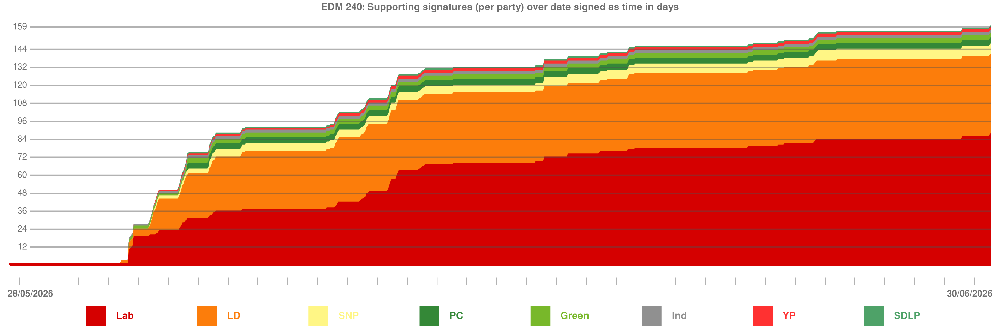

# EDM 240 Statistics

A collection of statistics, data, and graphs about EDM 240 (tabled 01/06/2026).

## Statistics 

Statistics can be found in the [STATS.md](STATS.md) file.

[STATS.md](STATS.md) is formatted with HTML, and is intentionally simple styling wise. 
This is done so that anyone can copy the statistics as plaintext, as is rendered in the GitHub UI, or as raw HTML for use where HTML is accepted.

## Graphs

Graphs can be found in the [graphs](graphs) folder, some of which are listed below:

## Data

The source code and dataset used to obtain these statistics are available at: [https://github.com/k8ey/edmdata](https://github.com/k8ey/edmdata).

JSON data files relating to [STATS.md](STATS.md) can also be found in [data](data).

## License

This repository makes use of data from the [https://developer.parliament.uk](https://developer.parliament.uk) APIs, and so this repository is licensed under the [**Open Parliament Licence v3.0**](https://www.parliament.uk/site-information/copyright-parliament/open-parliament-licence/).
